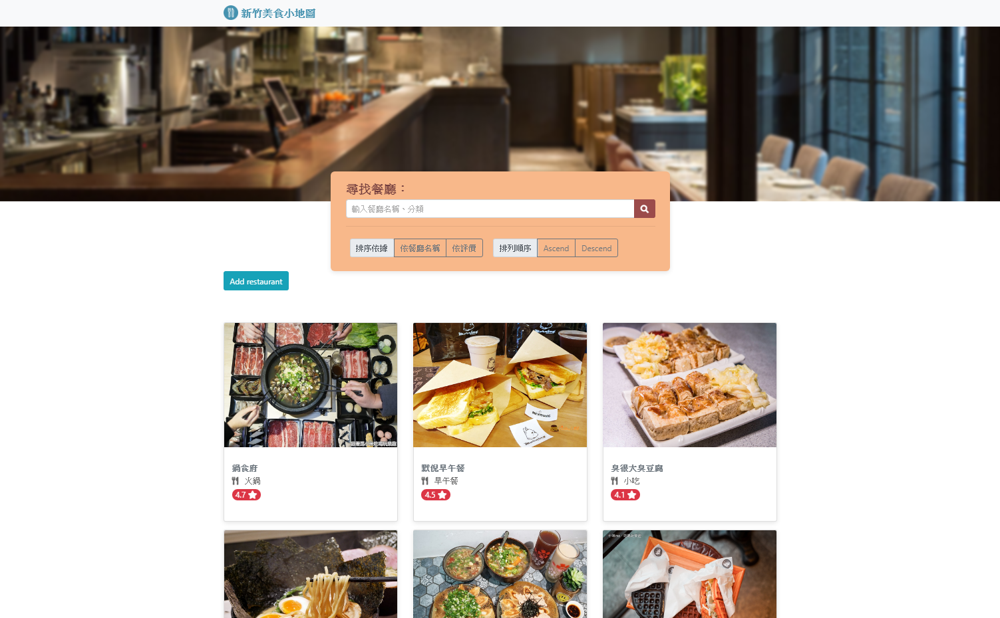
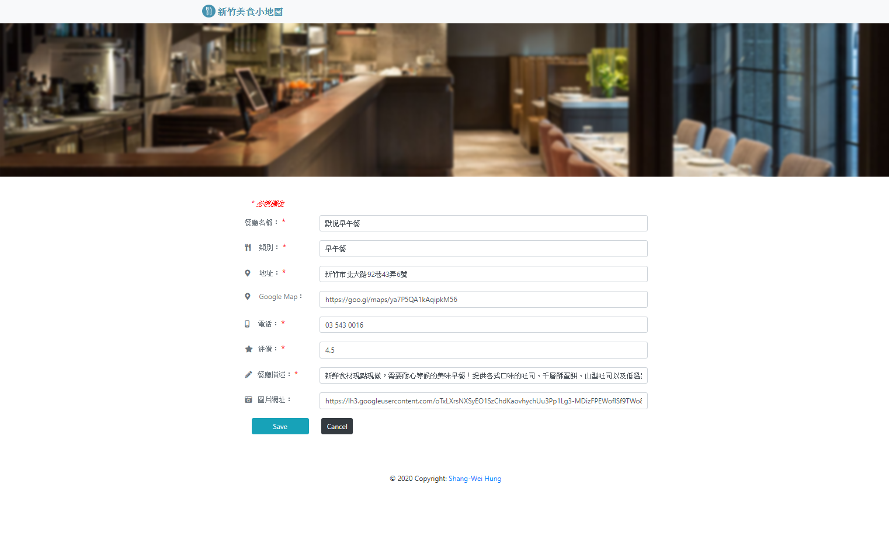
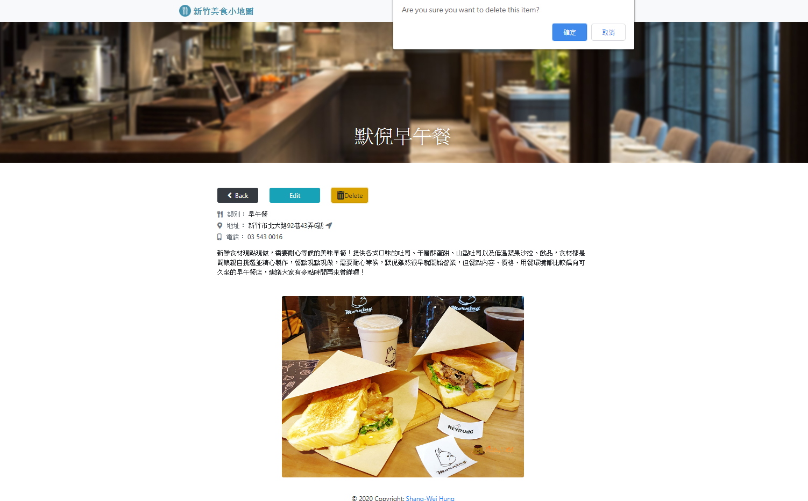

# Restaurant_Blog
This is full stack implementing responsive web application in Restaurant Blog case.

## Purpose
* Implement MVC model
* Build restaurant list RESTful API
* Build NoSQL (mongoDB) database
* Connect API with mongoDB using mongoose

## Development Environment
* Backend: Node.js  
* Backend-framework: Express  
* Database: MongoDB
* Front-end: HTML, CSS, Bootstrap

## Build Setup
```bash
npm install
```
## Functions
* Home: display all restaurants stored in the mongoDB.
* Detail: view one restaurants
* Add: add new restaurants into the mongoDB on the web.
* Edit: edit restaurants informations on the web.
* Search: search keywords or category of restaurants.

## Demo
#### Home Page

#### Detail Page

#### Search Page

#### Add Page

#### Edit Page

#### Delete Action

